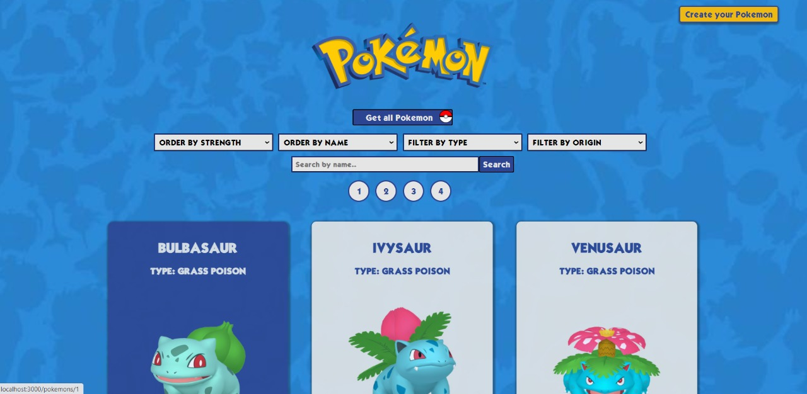
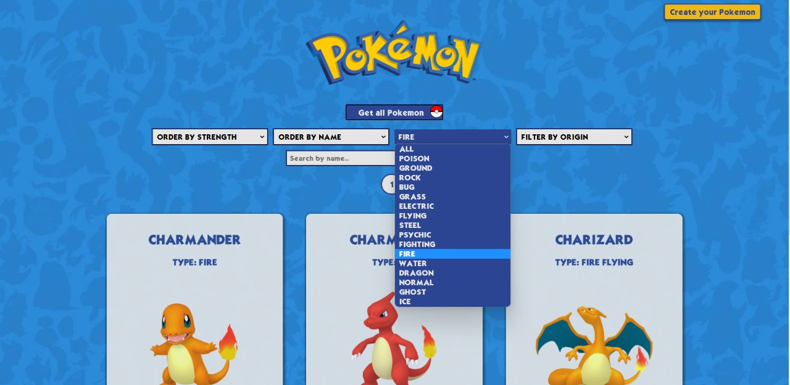
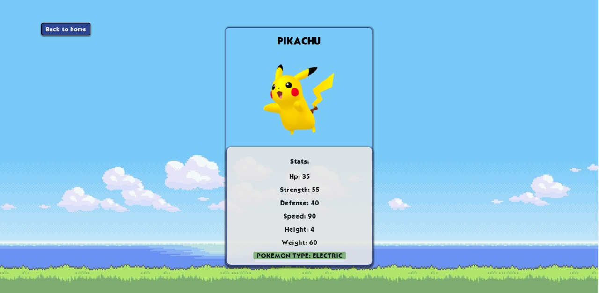
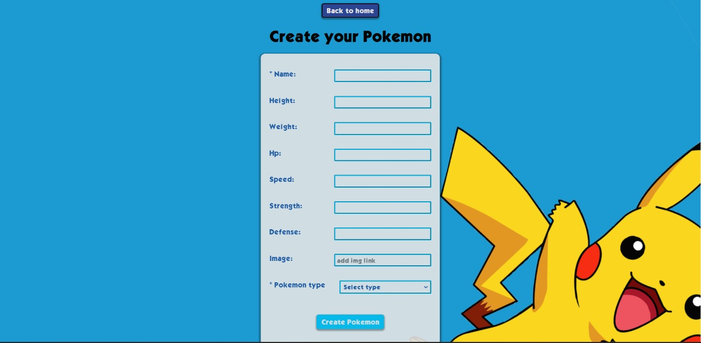

    

# Individual Project - Pokemon App

  
  
  
  

Preview: Link to [demo video](https://youtu.be/ez-3Dd37sO8)

Pokemon-themed SPA (single page application) developed as an individual project for Henry's Bootcamp.

It consumes data from the external API [pokeapi](https://pokeapi.co/) through a back-end developed in #Node.js using #Express. The database was created using #postgreSQL and #Sequelize. 
For the front-end i used #React and #Redux. Styles were given using #CSS, without using any libraries.

On the app you would be able to:
- View the information of 40 different pokemon.
- Navigate through pagination.
- Have access to extra pokemon details by clicking on each card.
- Sort alphabetically and by pokemon strength.
- Filter by pokemon type and by origin (created or from API).
- Search pokemon by exact name.
- Create your pokemon through a controlled form.
  